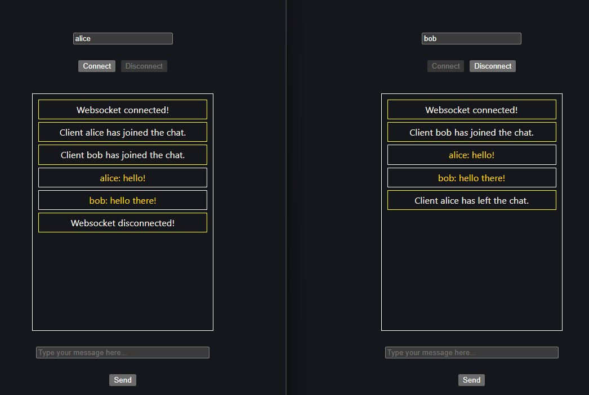

# Websocket Express React (Study Project)

Simple learning project to build a real-time chat app with websocket:
- `backend/`: Express + WebSocket server in TypeScript
- `frontend/`: React + Vite client in TypeScript

## What this project is about

This is an educational repo for learning how to connect a React app to a WebSocket backend and send messages in real-time.

- Backend accepts WebSocket clients, broadcasts messages, and handles basic connection events.
- Frontend connects to the backend and shows live updates in the UI.

## Prerequisites

- Node.js and Bun installed.
- Recommend using Bun for running tasks (as requested): `bun install`, `bun run`.

## Start Backend with Bun

1. Open a terminal.
2. `cd backend`
3. Install dependencies:
   - `bun install`
4. Start server:
   - `bun run dev`

The server should be running on `http://localhost:3000` (or the port defined in `backend/server.ts`).

## Start Frontend with Bun

1. Open another terminal.
2. `cd frontend`
3. Install dependencies:
   - `bun install`
4. Start dev server:
   - `bun run dev`

Vite frontend should open at `http://localhost:5173` (or the port shown in the terminal).

## Testing the full flow

- Open frontend in browser.
- Connect to backend via WebSocket as app UI says.
- Send/receive messages, verify broadcast and updates.

## Cleanup

- Stop backend and frontend with `Ctrl+C`.
- Optional: `bun install` in each folder again if you change dependencies.

## Notes

- If scripts differ (for example `dev` is not defined), use `bun run <script>` from `package.json`.
- If using npm/yarn is preferred, run `npm install` / `npm run dev` or `yarn` / `yarn dev` instead.
